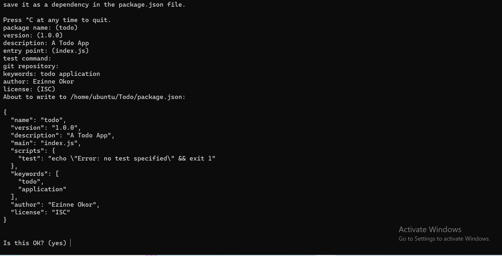
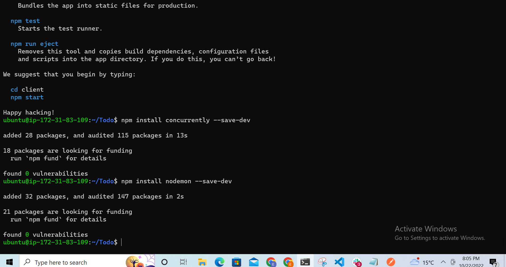

# PROJECT 3 DOCUMENTATION

### Update the ubuntu using
`sudo apt update`
### Upgrade  ubuntu using
`sudo apt upgrade`

### Get the location of Node.js software from Ubuntu repositories.
`curl -fsSL https://deb.nodesource.com/setup_18.x | sudo -E bash -`

### Install node.js using
`sudo apt-get install -y nodejs`

**The above command installs both the node.js and the package managers npm**

## Verify node installation using
`node -v`

### Verify the npm installation using
`npm -v`

### Create a new directory for the Todo setup
`mkdir Todo`
## Run the command below to verify the directory is created
`ls`

### Change your current directory into the Todo directory
`cd Todo`

### Initial your new Todo project using
`npm init`
**This ensures that all the packages are installed into your Todo project**
**follow the prompt and fill in the requred fields as seen in the image below**

### Run the ls command to ensure you have all the packages installed
`ls`

## STEP-2
### Install ExpressJs using
`npm install express`

### Create a new index.js file using
`touch index.js`

### Run ls to confirm it is successfully created

### install the dotenv module
`npm install dotenv`

### Open the index.js file using
`vim index.js`
### Write the code below into the index.js
`const express = require('express');
require('dotenv').config();

const app = express();

const port = process.env.PORT || 5000;

app.use((req, res, next) => {
res.header("Access-Control-Allow-Origin", "\*");
res.header("Access-Control-Allow-Headers", "Origin, X-Requested-With, Content-Type, Accept");
next();
});

app.use((req, res, next) => {
res.send('Welcome to Express');
});

app.listen(port, () => {
console.log(`Server running on port ${port}`)
});`

### Save the code in vim using
`:w`
### Exit from vim using
`qa`
### open your terminal in the same directory as your index.js
`node index.js`

### Edit your inbound rule to open TCP port 5000 in your EC2
### Open your browser using
`http://<ip address>:5000`

### Routes

**There are three actions that our To-Do application needs to be able to do:**

**Create a new task**
**Display list of all tasks**
**Delete a completed task**
**Each task will be associated with some particular endpoint and will use different standard HTTP request methods: POST, GET, DELETE.**

**For each task, we need to create routes that will define various endpoints that the To-do app will depend on. So let us create a folder routes**
`mkdir routes`
### Change directory to route folder
`cd routes`
### Create a file called api.js
`touch api.js`
### open the file using
`vim api.js`
### copy the code below into the file
`const express = require ('express');
const router = express.Router();

router.get('/todos', (req, res, next) => {

});

router.post('/todos', (req, res, next) => {

});

router.delete('/todos/:id', (req, res, next) => {

})

module.exports = router;`

**Save and exit vim using :w and :qa respectively**

## STEP-3
### MODELS
**We will also use models to define the database schema . This is important so that we will be able to define the fields stored in each Mongodb document.**
**In essence, the Schema is a blueprint of how the database will be constructed, including other data fields that may not be required to be stored in the database. These are known as virtual properties**
**To create a Schema and a model, install mongoose which is a Node.js package that makes working with mongodb easier.**

### Change directory back Todo folder with cd .. and install Mongoose
`npm install mongoose`

### Create a new folder models :
`mkdir models`
### Change directory into the newly created ‘models’ folder with
`cd models`
### Inside the models folder, create a file and name it todo.js
`touch todo.js`
**Tip: All three commands above can be defined in one line to be executed consequently with help of && operator, like this:**

`mkdir models && cd models && touch todo.js`
### Open the file created with vim todo.js then paste the code below in the file:
`const mongoose = require('mongoose');
const Schema = mongoose.Schema;

//create schema for todo
const TodoSchema = new Schema({
action: {
type: String,
required: [true, 'The todo text field is required']
}
})

//create model for todo
const Todo = mongoose.model('todo', TodoSchema);

module.exports = Todo;`
**Save and exit using :w and :qa**

**Now we need to update our routes from the file api.js in ‘routes’ directory to make use of the new model.**

**In Routes directory, open api.js with vim api.js, delete the code inside with :%d command and paste there code below into it then save and exit**

`const express = require ('express');
const router = express.Router();
const Todo = require('../models/todo');

router.get('/todos', (req, res, next) => {

//this will return all the data, exposing only the id and action field to the client
Todo.find({}, 'action')
.then(data => res.json(data))
.catch(next)
});

router.post('/todos', (req, res, next) => {
if(req.body.action){
Todo.create(req.body)
.then(data => res.json(data))
.catch(next)
}else {
res.json({
error: "The input field is empty"
})
}
});

router.delete('/todos/:id', (req, res, next) => {
Todo.findOneAndDelete({"_id": req.params.id})
.then(data => res.json(data))
.catch(next)
})

module.exports = router;`

## STEP-5
### MONGODB DATABASE
### Sign up for a m-lab account
**Allow access to the MongoDB database from anywhere (Not secure, but it is ideal for testing)**

**Change the time of deleting the entry from 6 Hours to 1 Week**
**Create a MongoDB database and collection inside mLab**
### In the index.js file, we specified process.env to access environment variables, but we have not yet created this file. So we need to do that now.

**Create a file in your Todo directory and name it .env.**
`touch .env`
`vi .env`
### Add the connection string to access the database in it, just as below:
`DB = 'mongodb+srv://<username>:<password>@<network-address>/<dbname>?retryWrites=true&w=majority'`
**To get your DB details, click on connect under your cluster in your mlab and select connection using application**
**Ensure to replace your username, password and dbname accordingly**

**Now we need to update the index.js to reflect the use of .env so that Node.js can connect to the database.**

**Simply delete existing content in the file, and update it with the entire code below.**

**To do that using vim, follow below steps**

**Open the file with** `vim index.js`
**Press** `esc`
**Type** `:`
**Type** `%d`
**Hit** `‘Enter’`
**The entire content will be deleted, then,**
**Press `i` to enter the insert mode in vim**
**Now, paste the entire code below in the file.**

`const express = require('express');
const bodyParser = require('body-parser');
const mongoose = require('mongoose');
const routes = require('./routes/api');
const path = require('path');
require('dotenv').config();

const app = express();

const port = process.env.PORT || 5000;

//connect to the database
mongoose.connect(process.env.DB, { useNewUrlParser: true, useUnifiedTopology: true })
.then(() => console.log(`Database connected successfully`))
.catch(err => console.log(err));

//since mongoose promise is depreciated, we overide it with node's promise
mongoose.Promise = global.Promise;

app.use((req, res, next) => {
res.header("Access-Control-Allow-Origin", "\*");
res.header("Access-Control-Allow-Headers", "Origin, X-Requested-With, Content-Type, Accept");
next();
});

app.use(bodyParser.json());

app.use('/api', routes);

app.use((err, req, res, next) => {
console.log(err);
next();
});

app.listen(port, () => {
console.log(`Server running on port ${port}`)
});`
**press ecs key then save and exit using :w and :qa**

### Start your server using
`node index.js`

### Testing Backend Code without Frontend using RESTful API
**So far we have written backend part of our To-Do application, and configured a database, but we do not have a frontend UI yet. We need ReactJS code to achieve that. But during development, we will need a way to test our code using RESTfulL API. Therefore, we will need to make use of some API development client to test our code.**
**You should test all the API endpoints and make sure they are working. For the endpoints that require body, you should send JSON back with the necessary fields since it’s what we setup in our code.**

**Now open your Postman, create a POST request to the API `http://<PublicIP-or-PublicDNS>:5000/api/todos`. This request sends a new task to our To-Do list so the application could store it in the database.**

**Note: make sure your set header key Content-Type as application/json and under body select "raw"**
**You will see a number under there ie 1, click on it, enter ur curly braces{"action":"Working on project3"} type the above inside and send to post it to your database. If it shows 200 ok means it was successfull**

### To use the GET request, follow the same above process but here select GET

## STEP-5 : FRONTEND CREATION
**To start out with the frontend of the To-do app, we will use the create-react-app command to scaffold our app.**
**In the same root directory as your backend code, which is the Todo directory, run:**
` npx create-react-app client`
**This will create a new folder in your Todo directory called client, where you will add all the react code.**
### Install concurrently. It is used to run more than one command simultaneously from the same terminal window.
`npm install concurrently --save-dev`
### Install nodemon. It is used to run and monitor the server. If there is any change in the server code, nodemon will restart it automatically and load the new changes.
`npm install nodemon --save-dev`

### In Todo folder open the package.json file. Change the script content of the package.json and replace with the code below.

`"scripts": {
"start": "node index.js",
"start-watch": "nodemon index.js",
"dev": "concurrently \"npm run start-watch\" \"cd client && npm start\""
},`

### Configure Proxy in package.json
**Change directory to ‘client’**
`cd client`
**Open the package.json file**
`vi package.json`
**Add the key value pair in the package.json file `"proxy": "http://localhost:5000"`.**
**The whole purpose of adding the proxy configuration above is to make it possible to access the application directly from the browser by simply calling the server url like http://localhost:5000 rather than always including the entire path like http://localhost:5000/api/todos**
### Now, ensure you are inside the Todo directory, and simply do:
`npm run dev`

**Your app should open and start running on localhost:3000**

**Important note: In order to be able to access the application from the Internet you have to open TCP port 3000 on EC2 by adding a new Security Group rule. You already know how to do it.**

**Creating your React Components**
**One of the advantages of react is that it makes use of components, which are reusable and also makes code modular. For our Todo app, there will be two stateful components and one stateless component.**
**From your Todo directory run**
`cd client`
**move to the src directory**
`cd src`
**Inside your src folder create another folder called components**
`cd components`
**Inside ‘components’ directory create three files Input.js, ListTodo.js and Todo.js.**
`touch Input.js ListTodo.js Todo.js`
**Open Input.js file**
`vi Input.js`
**Copy and paste the following**
`import React, { Component } from 'react';
import axios from 'axios';

class Input extends Component {

state = {
action: ""
}

addTodo = () => {
const task = {action: this.state.action}

    if(task.action && task.action.length > 0){
      axios.post('/api/todos', task)
        .then(res => {
          if(res.data){
            this.props.getTodos();
            this.setState({action: ""})
          }
        })
        .catch(err => console.log(err))
    }else {
      console.log('input field required')
    }

}

handleChange = (e) => {
this.setState({
action: e.target.value
})
}

render() {
let { action } = this.state;
return (

<input type="text" onChange={this.handleChange} value={action} />
<button onClick={this.addTodo}>add todo</button>

)
}
}

export default Input`
**To make use of Axios, which is a Promise based HTTP client for the browser and node.js, you need to cd into your client from your terminal and run yarn add axios or npm install axios.**

**Move to the src folder**
`cd ..`
**Move to clients folder**
`cd ..`
**Install Axios**
`npm install axios`

### Go to ‘components’ directory
`cd src/components`
**After that open your ListTodo.js**
`vi ListTodo.js`
**in the ListTodo.js copy and paste the following code**
`import React from 'react';

const ListTodo = ({ todos, deleteTodo }) => {

return (
<ul>
{
todos &&
todos.length > 0 ?
(
todos.map(todo => {
return (
<li key={todo._id} onClick={() => deleteTodo(todo._id)}>{todo.action}</li>
)
})
)
:
(
<li>No todo(s) left</li>
)
}
</ul>
)
}

export default ListTodo`
**Then in your Todo.js file you write the following code**
`import React, {Component} from 'react';
import axios from 'axios';

import Input from './Input';
import ListTodo from './ListTodo';

class Todo extends Component {

state = {
todos: []
}

componentDidMount(){
this.getTodos();
}

getTodos = () => {
axios.get('/api/todos')
.then(res => {
if(res.data){
this.setState({
todos: res.data
})
}
})
.catch(err => console.log(err))
}

deleteTodo = (id) => {

    axios.delete(`/api/todos/${id}`)
      .then(res => {
        if(res.data){
          this.getTodos()
        }
      })
      .catch(err => console.log(err))

}

render() {
let { todos } = this.state;

    return(
      

        <h1>My Todo(s)</h1>
        <Input getTodos={this.getTodos}/>
        <ListTodo todos={todos} deleteTodo={this.deleteTodo}/>
      

    )

}
}

export default Todo;`

**We need to make little adjustment to our react code. Delete the logo and adjust our App.js to look like this.**

**Move to the src folder**
`cd ..`
**Make sure that you are in the src folder and run**
`vi App.js`
**Copy and paste the code below into it**
`import React from 'react';

import Todo from './components/Todo';
import './App.css';

const App = () => {
return (

<Todo />

);
}

export default App;`

**After pasting, exit the editor.**

**In the src directory open the App.css**

`vi App.css`
**Then paste the following code into App.css:**
`.App {
text-align: center;
font-size: calc(10px + 2vmin);
width: 60%;
margin-left: auto;
margin-right: auto;
}

input {
height: 40px;
width: 50%;
border: none;
border-bottom: 2px #101113 solid;
background: none;
font-size: 1.5rem;
color: #787a80;
}

input:focus {
outline: none;
}

button {
width: 25%;
height: 45px;
border: none;
margin-left: 10px;
font-size: 25px;
background: #101113;
border-radius: 5px;
color: #787a80;
cursor: pointer;
}

button:focus {
outline: none;
}

ul {
list-style: none;
text-align: left;
padding: 15px;
background: #171a1f;
border-radius: 5px;
}

li {
padding: 15px;
font-size: 1.5rem;
margin-bottom: 15px;
background: #282c34;
border-radius: 5px;
overflow-wrap: break-word;
cursor: pointer;
}

@media only screen and (min-width: 300px) {
.App {
width: 80%;
}

input {
width: 100%
}

button {
width: 100%;
margin-top: 15px;
margin-left: 0;
}
}

@media only screen and (min-width: 640px) {
.App {
width: 60%;
}

input {
width: 50%;
}

button {
width: 30%;
margin-left: 10px;
margin-top: 0;
}
}`
**Exit**

**In the src directory open the index.css**

`vim index.css`
**Copy and paste the code below:**
`body {
margin: 0;
padding: 0;
font-family: -apple-system, BlinkMacSystemFont, "Segoe UI", "Roboto", "Oxygen",
"Ubuntu", "Cantarell", "Fira Sans", "Droid Sans", "Helvetica Neue",
sans-serif;
-webkit-font-smoothing: antialiased;
-moz-osx-font-smoothing: grayscale;
box-sizing: border-box;
background-color: #282c34;
color: #787a80;
}

code {
font-family: source-code-pro, Menlo, Monaco, Consolas, "Courier New",
monospace;
}`

**Go to the Todo directory**

`cd ../..`
**When you are in the Todo directory run:**

`npm run dev`
